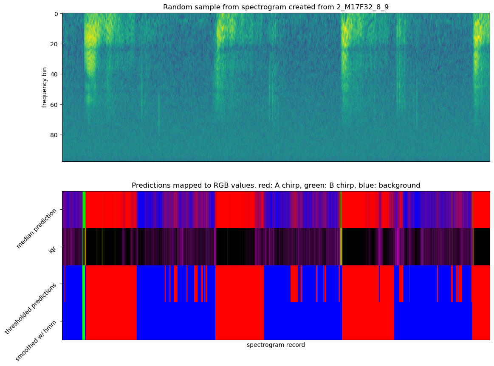

# beetles-cnn
Pipeline for classifying beetle chirps in raw recordings.
# Using

Currently no pip package is available, so clone this repository locally.
Optionally create a virtual environment with the tool of your choice (conda example below)
```
conda create -n beetles && conda activate beetles
```
And install the requirements with 
```
pip install -r requirements.txt
```
The pipeline to evaluate a .wav file resides in infer.py, which requires at least one
argument specifying a .wav file to analyze. Once given a .wav file, there are three *non*-mutually 
exclusive options to choose from: 
todo: talk about the code downloading models from s3

```--plot_prefix```, ```--output_csv_path```, and ```--debug```.
# --plot_prefix
todo: add wav_files/example.wav to repo plus minimum example for interactive_plot.py
```
python infer.py --wav_file ./wav_files/example.wav  --plot_prefix ./images/example_evaluated
```
This will analyze the input wav file and save --n_images images (default: 30) to the location 
specified with ```--plot_prefix```, in the format <plot_prefix>_<wav_filename>_<number>.png. This option is good for a
quick sanity check of the predictions when using interactive_plot.py isn't necessary.

Example image is below. The same image is produced by interactive_plot.py but *interactive* so you
can scroll along the x-axis.


The raw spectrogram is shown in the top image . The second image contains all auxiliary data,
consisting of four rows.
### Row 1
todo: make this generalizable to more than three classes.
Ensemble softmax predictions. Colors are softmax probabilities per channel mapped to RGB. Red means 
the ensemble strongly predicted A chirps, blue background, and green B chirps. Colors in between mean
the ensemnle was less confident about which class to choose (purple means the ensemble couldn't choose b/t
A and background).
### Row 2
Inter-quartile range of the model ensemble, also referred to as uncertainty. Brighter colors mean 
higher uncertainty. Yellow means the ensemble oscillated around A and B classifications, purple when 
the oscillations were around A and background, and cyan between B and background. 
### Row 3
The argmax of row 1, but thresholded on uncertainty values. Notice that predictions that are red in
the first row and purple in the second are blue in the third. We set any classification of A that had 
high uncertainty to background. Implementing similar heuristics based on observation will result in 
better performance.
### Row 4
Final predictions after smoothing with HMM. Notice there is still a misclassification where
the final prediction is B and the underlying data is most likely background. This can be fixed
with the proper heuristic.

# --output_csv_path
```
python infer.py --wav_file ./wav_files/example.wav  --output_csv_path ./results/example_results.csv
```
Specifying the output_csv_path will save a comma-delimited file to --output_csv_path that looks like this
```
Selection,View,Channel,Begin Time (s),End Time (s),Low Freq (Hz),High Freq (Hz),Sound_Type
1,0,0,0.0,2.120833333333333,0,0,BACKGROUND
2,0,0,2.1666666666666665,5.079166666666667,0,0,BACKGROUND
3,0,0,5.125,68.04583333333333,0,0,BACKGROUND
4,0,0,68.15833333333333,69.02083333333333,0,0,BACKGROUND
5,0,0,69.18333333333334,76.675,0,0,BACKGROUND
6,0,0,76.85416666666667,77.9875,0,0,BACKGROUND
7,0,0,78.19583333333333,78.35416666666667,0,0,BACKGROUND
8,0,0,78.42916666666666,79.10833333333333,0,0,BACKGROUND
9,0,0,79.19583333333333,79.925,0,0,BACKGROUND
```
This contains all 0s for data usually exported by Raven so you can tell if you're looking at model
predictions. 

# --debug
Save the five necessary files required to run interactive_plot.py in ```$PWD/debug/```.
Will save the raw spectrogram, predictions post-hmm, the median prediction of the ensemble 
per class, uncertainty of the ensemble, and the .csv file containing the begin and end of each
sound type.
# interactive_plot.py
### Warning: 
This requires a lot of data and sliding can be slow, especially if you're running other processes.

```
usage: interactive_plot.py [-h] --debug_data_path DATA_PATH [--sample_rate SAMPLE_RATE] [--hop_length HOP_LENGTH]

optional arguments:
  -h, --help            show this help message and exit
  --debug_data_path DATA_PATH
  --sample_rate SAMPLE_RATE
                        sample rate of audio recording
  --hop_length HOP_LENGTH
                        length of hops b/t subsequent spectrogram windows
```
Requires output produced by infer.py with the --debug flag. Displays a matplotlib plot with a slider 
to ease visual inspection of the whole spectrogram. This utility is useful for when you've implemented
a new heuristic or changed the hmm and want to see what the large-scale impacts of your changes are.
Slide along the x-axis by clicking and dragging the slider on the bottom.

# Implementing new heuristics for application in infer.py and interactive_plot.py
Open and edit heuristics.py. Each function you implement is required to have only two arguments:
predictions (numpy array (size 1xN) of argmaxed median predictions i.e. ```[0, 1, 2, 0, 0]```), and 
inter-quartile range (referred to as uncertainty or iqr: numpy array (size 3xN) containing the 
ensemble uncertainty for each class at each time point). After manipulating predictions based on
some rule, return it for processing by the next function in the heuristic function list. Templates 
showing basic thresholding of predictions based on uncertainties are included. 
Pull requests welcome!
Since it can be computationally intensive to re-predict all of the data with infer.py and then apply 
new heuristics to the prediction, interactive_plot.py also supports manipulating predictions
with the heuristics in heuristics.py (if you're not tired of hearing the word "heuristic" I'm impressed).
This will run your custom heuristics on the data produced by infer.py with the --debug flag but won't 
save the results anywhere, since it's for on-the-fly iteration and debugging. To actually save the results with
new heuristics re-run infer.py with ```--output_csv_path``` set.

# How it works

# Known failure cases

